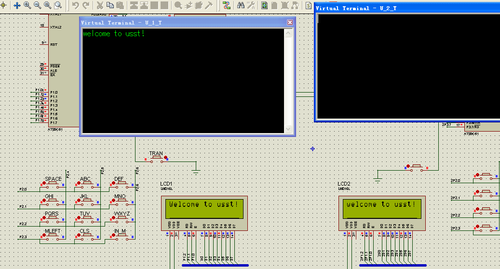
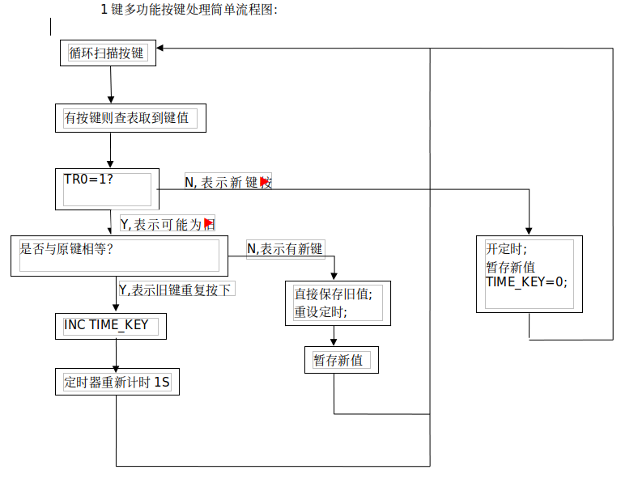
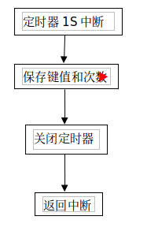

# 51 MCU 课程设计

##### 无意中翻到一个十年前在学校里写的一个课程设计作业。是用51汇编写的一个串口聊天工具。共享出来给供大家参考。

我们在proteus软件上仿真模拟了一个聊天工具。两机地位相同，无主从之分。

我们用4*3矩阵键盘模拟手机的9宫格输入键盘。键盘上有三个功能键，一个左移键MLEFT（其功能相当于删除键）,一个清屏键CLS，一个输入法切换键IN_M,按IN_M键可以在大小写字母、阿拉伯数字三种输入状态之间切换，以及其他的非功能输入键。按TRAN键可将输入的文字通过串口发送给对方，并显示在液晶屏1602上。

​	输入方式字母或数字的方式与手机上输入基本相同。按下一个键后，如果在1S内没有再按键则保存当前键，如果当前键重复按下则输入该键代表的下一个字母或数字，依此类推，可用一个键输入多个字符。如果1S未过按下另外一个键，则前一键立即保存，等待另个这一键的输入。

